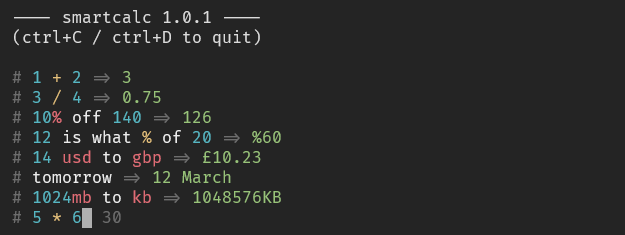

# smartcalc-tui

Terminal UI for [erhanbaris/smartcalc](https://github.com/erhanbaris/smartcalc),
a new way to do calculations on-the-fly. From the README:

> Do your calculation on text based queries and see the result immediately.
> Still it is under development but it is enough to use it on daily purpose.
> Supports money conversion, percentage calculation and basis time calculation
> but still not fully supported. For now, we support only in english language
> but if any want to help to translate, we can easily integrate new language.

A number of different operations are supported. To see the full list, see
[here](https://github.com/erhanbaris/smartcalc).

## Project Status

This project is under active development. Some existing functionality may not
work as expected.

Use at your own risk :slightly_smiling_face:

## License

The SmartCalc project is distributed under the GNU General Public License. This
project is available under the MIT License, &copy; 2022 Aaron Ross. All rights
reserved.
